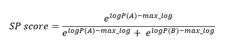

# SPHAK

**SPHAK** is a simple proteome-based sequence similarity framework that could quantify spillover risk and predict viral family in animal and plant kingdom.

## Project Overview

Traditional models rely on ecological or phenotypic features, or focus primarily on genomic sequences, to predict host spillover. SPHAK is a comand line interface tool that identifies proteome-level sequence patterns specific to animal- and plant-infecting viruses to:

- Predict the viral family 
- Score the likelihood of host switching or spillover
  
SPHAK can work with different virus families from various kingdoms.

## 🔧 Pipeline Overview

SPHAK involves the following steps:

### 1. **k-mer size optimization**
- To identify an optimal k-mer size that captures discriminative sequence patterns in both animal and plant-infecting viruses, enabling accurate downstream host prediction and spillover analysis. The k-mer size of 6 is fixed as an optimum k-mer size in animal and plant viruses.


### 2. **Training & Reference Database Setup**
- Training is performed to generate the reference database by extracting host-specific k-mers from curated proteomes
- Extract 6-mer sequences from host proteomes to create a reference database
- Only high-confidence k-mers are kept (animal ≥40 occurrences, plant ≥5)
- Low-complexity or ambiguous k-mers are removed
- The database stores k-mer patterns for predicting viral hosts


### 3. **Testing**
- Apply the SPHAK method to new or unlabelled viral protein sequences.
The method outputs predicted viral family and spillover risk through SP score(Spillover Potential score).
- **SP score calculation**: 
- **Formula**:





## ⚙️ Installation

```bash
git clone https://github.com/VITresearchgroup2024/SPHAK.git
cd SPHAK
pip install .

Adjust installation steps as needed for your environment.

usage: sphak [-h] --input INPUT --host_type {animal,plant}

options:
  -h, --help            show this help message and exit
  --input INPUT         Path to FASTA file
  --host_type {animal,plant}
                        Host type

```
---

## 📊 Dataset

👉 The dataset used in this study is publicly available on Zenodo:

🔗 [https://doi.org/10.5281/zenodo.16326468](https://doi.org/10.5281/zenodo.16326468)

[](https://doi.org/10.5281/zenodo.16326468)


## 📚 Citation

- Manuscript under review. Please contact the authors before citing.
Developed by the VIT Research Team (2024–2025).

📬 Contact
For questions, please open an issue or email:
✉️ vibin@cmscollege.ac.in
✉️ vinning372@gmail.com
✉️ ananyaprakash0105@gmail.com
✉️ kavyasree6424@gmail.com

